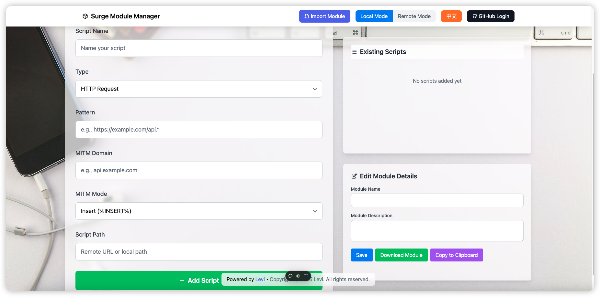

# Surge Module Manager 2.0

A powerful module management tool for Surge, helping you better manage and utilize Surge's module functionality.



## Table of Contents
- [Features](#features)
- [Installation](#installation)
- [Usage Guide](#usage-guide)
- [FAQ](#faq)
- [Changelog](#changelog)

## Features

- 🚀 One-click Module Import
- 📦 Module Version Management
- 🔄 Automatic Update Detection
- 🎨 Clean User Interface
- 🔒 Secure and Reliable
- 🌐 Online Module Marketplace

## Installation

1. Open the configuration page in Surge
2. Click on "Modules"
3. Click the "+" button in the top right corner
4. Enter the following installation link:
   ```
   https://raw.githubusercontent.com/username/surge-module-manager/main/install.sgmodule
   ```
5. Click "Install" to complete

## Usage Guide

### Basic Usage

1. **Import Modules**
   - Open Surge Module Manager
   - Click "Import Module" button
   - Enter module link or select from marketplace

2. **Manage Installed Modules**
   - View list of installed modules
   - Enable/Disable modules
   - Update module versions
   - Remove unwanted modules

3. **Module Marketplace**
   - Browse recommended modules
   - View module details
   - Install with one click

### Advanced Features

1. **Custom Settings**
   - Configure automatic update checks
   - Set module priorities
   - Customize module parameters

2. **Module Backup & Restore**
   - Export module configurations
   - Import backup configurations
   - Sync settings

## FAQ

**Q: How do I update module versions?**
A: In the module list, click on the module you want to update, then click the "Check for Updates" button.

**Q: Why can't I import certain modules?**
A: Please check:
- If the module link is valid
- If your network connection is stable
- If the module format is correct

**Q: How do I resolve module conflicts?**
A: You can resolve conflicts by adjusting module priorities or disabling conflicting modules.

## Changelog

### 2.0.0 (2025-01-06)
- New user interface
- Added module marketplace
- Improved update detection
- Enhanced overall performance
- Fixed known issues

## Support & Contact

For issues or suggestions, please contact me.
- GitHub Issues

[简体中文](readme_cn.md)

---

© 2025 Surge Module Manager. All rights reserved.
