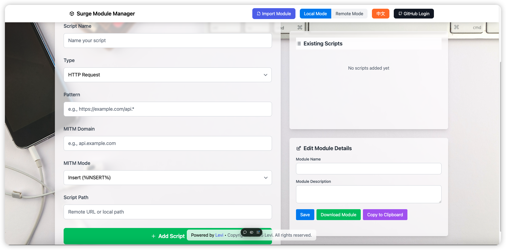

# Surge Module Manager - Deployment Guide

> Looking for the Chinese version? [Click here to view 中文文档](./README.zh.md)
>
> 

## 📦 Introduction

**Surge Module Manager** is a user-friendly online interface for managing [Surge](https://nssurge.com) modules. It helps users import, manage, and update modules efficiently. This guide provides instructions to deploy this project locally or on Vercel.

---

## 🚀 Deployment Steps

### 1. Clone the Repository

```bash
git clone https://github.com/czy13724/surge-module-manager.git
cd surge-module-manager
```

### 2. Install Dependencies

Make sure you have [Node.js](https://nodejs.org/) installed, then run:

```bash
npm install
```

### 3. Start Local Development

```bash
npm run dev
```

By default, the site will run at `http://localhost:3000`.

### 4. Build for Production

```bash
npm run build
npm start
```

### 5. Edit Within the Interface

Follow the on-screen instructions to edit content directly within the interface. Once the file is generated, it will be saved locally. You can use iCloud for file syncing, or host the files on GitHub or any other hosting platform.

### 6. Fetch Subscriptions

Pull the remote links to get the subscription data. Import the resulting link into the Surge module manager.

## Deploying to Vercel

This project supports one-click deployment to Vercel.

 ⚠️Note that it is intended for frontend display purposes only and should not be used for actual production use.

### Deploy on Vercel

This project is Vercel-ready.

Steps:
1. Go to [vercel.com](https://vercel.com/).
2. Create a new project and import the GitHub repository.
3. Vercel will automatically detect the project settings and deploy it.

After deployment, you will get a link like: `https://your-project.vercel.app`

---

## 🧩 Using the Interface

- Click **Add Module Source** to enter the module's raw URL.
- You can enable, disable, delete, or update modules from the list.

---

## ❓ FAQ

**Q:** Where can I get module URLs?

**A:** From GitHub `.sgmodule` files, click "Raw" and copy the link.

**Q:** Why can't a module load?

**A:** Ensure the URL is correct and publicly accessible.

## ❓ Other Issues

The generated file content cannot be re-imported into the project, which is very inconvenient. There is a phenomenon of loss.

The remote mode needs to be done with the help of the server, which is not friendly to users without a server.

---

Looking for the Chinese version? [点击查看中文文档](./README.zh.md)

](readme_cn.md)

---

© 2025 Surge Module Manager. All rights reserved.
