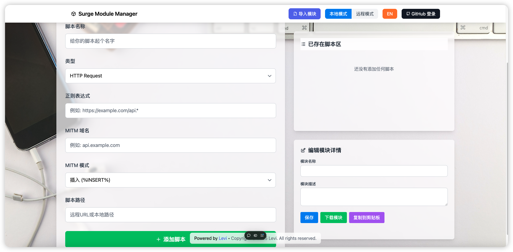

# Surge 模块管理器 - 部署指南

> Looking for the English version? [Click here for English version](./README.md)
>
> 

## 📦 项目简介

**Surge Module Manager** 是一个用于 [Surge](https://nssurge.com) 模块管理的在线界面，用户可以方便地导入、启用、禁用、更新模块。本文档将指导你如何在本地或 Vercel 上部署此项目。

---

## 🚀 部署步骤

### 1. 克隆项目

```bash
git clone https://github.com/czy13724/surge-module-manager.git
cd surge-module-manager
```

### 2. 安装依赖

请确保你已安装 [Node.js](https://nodejs.org/)，然后运行：

```bash
npm install
```

### 3. 本地开发模式启动

```bash
npm run dev
```

默认运行在 `http://localhost:3000`

### 4. 构建生产环境版本

```bash
npm run build
npm start
```

### 5. 在界面内进行编辑

在界面内按照提示编辑内容即可。文件生成后会存储到本地，你可以借助iCloud进行同步文件，也可以将文件托管到GitHub或其他可托管平台。

### 6. 拉取订阅

将远程链接进行拉取。获得链接导入Surge模块即可。

## 部署到 Vercel

此项目支持一键部署到 Vercel，仅能做前端展示，不可用于真实用途。

部署方法：

1. 访问 [vercel.com](https://vercel.com/)
2. 新建项目，导入该 GitHub 仓库
3. 自动检测并部署，无需手动配置

部署完成后，你会获得一个如 `https://your-project.vercel.app` 的网址。

---

## 🧩 使用指南

- 点击“添加模块源”，输入模块的原始链接（Raw URL）。
- 在模块列表中，你可以启用、禁用、删除、更新模块。

---

## ❓ 常见问题

**问：** 模块链接在哪里找？

**答：** 在 GitHub 上找到 `.sgmodule` 文件，点击 “Raw”，复制地址即可。

**问：** 模块加载失败怎么办？

**答：** 确保模块地址正确，且对公网可访问。

## ❓ 待解决问题

1. 生成的文件内容不可以重新导入该项目，有很大不便。有丢失现象。
2. 远程模式需要借助服务器搞定，对没有服务器的用户不友好。

---

English version available: [Click here for English version](./README.md)
