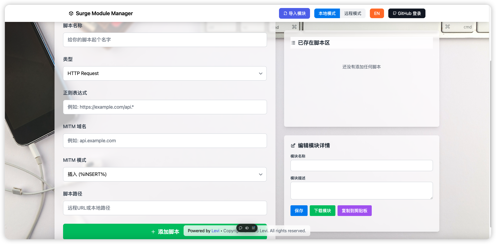

# Surge Module Manager 2.0

Surge Module Manager 2.0 是一个强大的 Surge 模块管理工具，帮助您更好地管理和使用 Surge 的模块功能。



## 目录
- [功能特点](#功能特点)
- [安装说明](#安装说明)
- [使用教程](#使用教程)
- [常见问题](#常见问题)
- [更新日志](#更新日志)

## 功能特点

- 🚀 一键导入模块
- 📦 模块版本管理
- 🔄 自动更新检测
- 🎨 简洁的用户界面
- 🔒 安全可靠
- 🌐 支持在线模块市场

## 安装说明

1. 在 Surge 中打开配置页面
2. 点击"模块"选项
3. 点击右上角的"+"按钮
4. 输入以下安装链接：
   ```
   https://raw.githubusercontent.com/username/surge-module-manager/main/install.sgmodule
   ```
5. 点击"安装"即可完成

## 使用教程

### 基础使用

1. **导入模块**
   - 打开 Surge Module Manager
   - 点击"导入模块"按钮
   - 输入模块链接或从模块市场选择

2. **管理已安装模块**
   - 查看已安装模块列表
   - 启用/禁用模块
   - 更新模块版本
   - 删除不需要的模块

3. **模块市场**
   - 浏览推荐模块
   - 查看模块详情
   - 一键安装

### 高级功能

1. **自定义设置**
   - 配置自动更新检查
   - 设置模块优先级
   - 自定义模块参数

2. **模块备份与恢复**
   - 导出模块配置
   - 导入备份配置
   - 同步设置

## 常见问题

**Q: 如何更新模块版本？**
A: 在模块列表中，点击需要更新的模块，然后点击"检查更新"按钮。

**Q: 为什么某些模块无法导入？**
A: 请检查：
- 模块链接是否有效
- 网络连接是否正常
- 模块格式是否正确

**Q: 如何解决模块冲突？**
A: 可以通过调整模块优先级或禁用冲突的模块来解决。

## 更新日志

### 2.0.0 (2025-01-06)
- 全新的用户界面
- 添加模块市场功能
- 优化更新检测机制
- 提升整体性能
- 修复已知问题

## 联系与支持

如有问题或建议，请通过主页方式联系我。
- GitHub Issues

[English](readme.md)

---

© 2025 Surge Module Manager. 保留所有权利。
